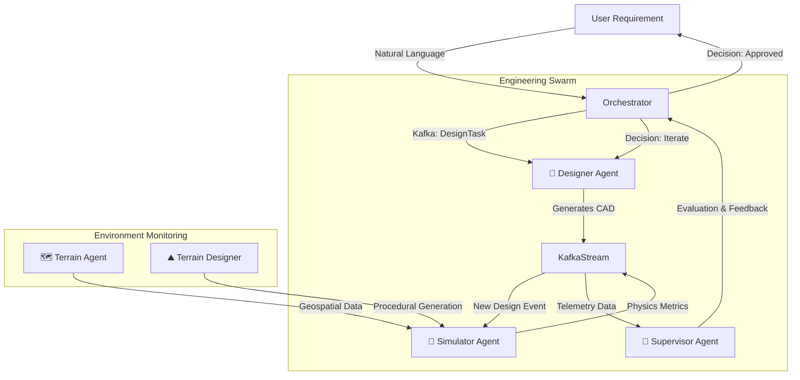

<div align="center">

# 🚀 aeroForge-G3
### **Autonomous Generative Engineering Platform**

**Transform Natural Language Into Production-Ready Systems Using Multi-Agent AI**

[](https://opensource.org/licenses/MIT)
[](https://www.python.org)
[](https://github.com/langchain-ai/langgraph)
[](https://openrouter.ai/models)
[](https://kafka.apache.org/)

---

**🏆 Gemini 3 Hackathon Submission | February 2025**

</div>

---

## ✨ Overview

**aeroForge-G3** is a revolutionary AI-powered engineering platform that transforms natural language requirements into **production-ready mechanical systems** through autonomous design, multi-physics simulation, and iterative optimization.

While initially demonstrated on aerospace vehicles, the core architecture is domain-agnostic—capable of designing structural trusses, robotic assemblies, and complex mechanical linkages.

### 🎯 The Vision

What if you could design a mission-critical system simply by describing it?
> *"Design a rapidly deployable modular bridge for high-altitude terrain capable of supporting 50kg loads with a safety factor of 2.5."*

**aeroForge-G3 makes this possible.**

Our system:
1. 🤖 **Reasoning Core**: Understands complex engineering constraints using **Google Gemini 3 Pro**.
2. 🎨 **Generative Design**: Creates parametric CAD models via Python (`build123d`).
3. 🧪 **Validation**: Runs high-fidelity physics simulations on **Genesis**.
4. 🔄 **Optimization Loop**: Autonomously iterates until safety and performance metrics are met.
5. 🌐 **Distributed Scale**: Orchestrates workloads across a global GPU cluster via **Apache Kafka**.

---

## 🧠 Architecture: The Multi-Agent Swarm

aeroForge-G3 replaces the traditional linear design process with a **collaborative swarm of specialized AI agents**, all operating concurrently and communicating via **Kafka event streams**.



### 🤖 Specialized Agents
1.  **Designer Agent** (`agents/designer.py`): The creative architect. Translates constraints into parametric geometry ensuring manufacturability.
2.  **Simulator Agent** (`agents/simulator.py`): The physics engine interface. Validates aerodynamics, structural integrity, and thermal limit using **Genesis**.
3.  **Supervisor Agent** (`agents/supervisor.py`): The lead engineer. Reviews simulation telemetry against initial requirements and issues "Change Orders" if specs are missed.
4.  **Terrain Supervisor** (`agents/terrainSupervisor.py`): Analyzes geospatial data to ensure the design fits the specific deployment environment.
5.  **Terrain Designer** (`agents/terrainDesigner.py`): Generates 3D environmental contexts (e.g., Himalayan peaks, Martian surface) for realistic testing.

---

## 🛠️ Infrastructure & Distributed Compute

A true engineering platform requires immense compute power. WE built a custom infrastructure layer to handle it.

### ⚡ Distributed Compute Layer
Located in `core/infrastructure/distributed_compute.py`, this module allows aeroForge to offload heavy physics simulations to remote nodes.
- **Task Sharding**: Breaks massive simulation matrices into smaller chunks.
- **Node Discovery**: Automatically finds available workers in the cluster.
- **Result Aggregation**: Recompiles telemetry from thousands of parallel sim steps.

### 🌩️ Vultr GPU Manager
Located in `core/infrastructure/vultr_gpu_manager.py`, this system dynamically scales our infrastructure.
- **Auto-Scaling**: Provisions **NVIDIA H100 Tensor Core** instances on Vultr for massive parallelism.
- **Real-Time Physics**: Achieves >60Hz simulation rates for complex multiphysics interactions.
- **Cost Optimization**: Terminates idle instances automatically.
- **CUDA Kernels**: Deploys custom CUDA kernels (`core/infrastructure/cuda_kernels.py`) for optimized tensor operations.

### 📨 Kafka Event Streams
We use **Apache Kafka** as the central nervous system.
- **Decoupled Architecture**: Agents don't talk directly; they publish to topics (`design.created`, `sim.completed`).
- **Replayability**: Every design decision is logged and can be replayed for debugging.
- **Real-Time Telemetry**: The frontend subscribes to these streams via WebSockets for live "thinking process" visualization.

---

## 🎨 Technology Stack

### Core Intelligence
- **Google Gemini 3 Pro**: The brain behind the reasoning.
- **LangGraph**: Orchestrates the stateful multi-agent workflows.
- **OpenRouter**: Unified API gateway for model access.

### Engineering & Simulation
- **build123d**: Python-first parametric CAD kernel.
- **Genesis**: High-fidelity physics engine running in **real-time on H100 clusters**.
- **OpenCascade**: Industrial-grade geometry kernel.

### Backend Infrastructure
- **FastAPI**: Asynchronous Python API.
- **Apache Kafka**: Event streaming platform.
- **Redis**: Fast state caching for agents.
- **Docker**: Containerized deployment for scalable agents.

### Frontend Experience
- **React 18**: High-performance UI library.
- **Three.js / React-Three-Fiber**: WebGL-based 3D visualization.
- **TailwindCSS**: Utility-first styling for the "Industrial Future" aesthetic.

---

## 🚀 Quick Start

### Prerequisites
- **Python 3.11+**
- **Node.js 18+**
- **OpenRouter API Key**
- **Kafka Cluster** (Optional - runs in local mode without it)

### Installation

```bash
# 1. Clone the repository
git clone https://github.com/GodlyDonuts/aeroForge.git
cd aeroForge

# 2. Backend Environment
python3 -m venv venv
source venv/bin/activate
pip install -r requirements.txt

# 3. Frontend Environment
cd frontend
npm install
cd ..

# 4. Configure Secrets
cp .env.example .env
# Add your OPENROUTER_API_KEY and VULTR_API_KEY
```

### Running the Platform

```bash
# Terminal 1: Distributed Backend
python3 app.py
# → http://localhost:8000

# Terminal 2: Engineering Console
cd frontend
npm run dev
# → http://localhost:5173
```

---

## 🔬 Deep Dive: The "Deep Think" Loop

aeroForge-G3 isn't just a chatbot—it's a reasoning engine. When you issue a command, the **"Deep Think"** process begins:

1.  **Intent Parsing**: `supervisor.py` decomposes your prompt into technical specs (e.g., "stability in high winds" -> `max_deflection < 5mm`, `drag_coefficient < 0.4`).
2.  **Kernel Generation**: `designer.py` writes a Python script using `build123d` to generate the geometry.
3.  **HPC Simulation**: `distributed_compute.py` shards the simulation across available GPU nodes.
4.  **Convergence Check**: If the system fails requirements, the Supervisor rejects the design and prompts the Designer with specific "Fix Instructions" (e.g., "Increase truss thickness by 15%").

This loop continues until a valid engineering solution is found.

---

## 📚 Project Structure

```
aeroforge-G3/
├── 📁 agents/                 # AI Agents Swarm
│   ├── designer.py           # Generative CAD Agent
│   ├── simulator.py          # Physics & Validation Agent
│   ├── supervisor.py         # Lead Engineering Agent
│   ├── terrainDesigner.py    # Environment Generation
│   └── terrainSupervisor.py  # Geospatial Analysis
│
├── 📁 core/                   # Core Libraries
│   ├── infrastructure/       # Distributed Compute Layer
│   │   ├── distributed_compute.py
│   │   ├── vultr_gpu_manager.py
│   │   ├── cuda_kernels.py
│   │   └── security_layer.py
│   ├── ai/                   # AI Model Wrappers
│   │   ├── geometry.py       # Geometric Reasoning
│   │   └── state.py          # State Management
│   ├── physics/              # Physics Engine Adapters
│   │   ├── fluid_dynamics.py
│   │   └── structural.py
│   ├── geometry.py           # CAD Kernel Extensions
│   └── physics.py            # Genesis Engine Wrapper
│
├── 📁 frontend/               # React Engineering Console
│   ├── src/
│   │   ├── components/       # UI Components
│   │   │   ├── Visualizer3D.jsx
│   │   │   ├── TelemetryTerminal.jsx
│   │   │   ├── MissionInput.jsx
│   │   │   ├── EnvironmentControlPanel.jsx
│   │   │   ├── MissionInitiation.jsx
│   │   │   ├── DroneModel.jsx
│   │   │   ├── DroneModelv2.jsx
│   │   │   └── DroneModelv3.jsx
│   │   ├── engine/           # Frontend Logic
│   │   │   ├── SimpleDemo.js
│   │   │   └── SimulationEngine.js
│   │   ├── App.jsx           # Main Layout
│   │   └── main.jsx          # Entry Point
│
├── 📄 app.py                 # FastAPI Gateway
├── 📄 main.py                # LangGraph Orchestrator
├── 📄 server.py              # Backend Server
└── 📄 README.md              # This file
```

---

## 🚧 Roadmap

### v4.0 - Generative Manufacturing
- [ ] G-Code generation for 5-axis CNC.
- [ ] PCB layout generation for control systems.
- [ ] Automated BOM (Bill of Materials) costing.

### v5.0 - Physical Twin
- [ ] Integration with real-world robotic assembly cells.
- [ ] Reality-gap transfer learning (Sim2Real).

---

## 🤝 Contributing

We welcome engineers, potential contributors, and AI researchers!
Check out our core agents in `agents/` to see how we implement decision-making loops.

---

## 📄 License

MIT License - feel free to use this project for research, commercial, or personal projects.

---

## 🙏 Acknowledgments

- **Google** for the incredible Gemini 3 model
- **LangChain** for the orchestration framework
- **Genesis Project** for the physics engine
- **SpaceX** for the inspiring industrial aesthetic
- **Apache Kafka** for the streaming architecture

---

<div align="center">

**🚀 aeroForge-G3 — Engineering At The Speed of Thought**

</div>
