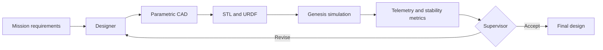

# AeroForge

**Describe a vehicle, generate parametric CAD, simulate it, and feed the result back into the next design.**

I built AeroForge around a problem I kept seeing in generative CAD demos: producing a plausible-looking shape is treated as the finish line. Here, generated geometry has to execute, export, enter a physics environment, and survive a review loop before the system accepts it.

The current prototype focuses on multirotor aircraft. A mission description becomes `build123d` code, the model is exported to STL and URDF, Genesis produces motion and stability telemetry, and a supervisor either approves the design or sends specific feedback into another iteration.

## The loop


```mermaid
flowchart LR
    A[Mission requirements] --> B[Designer]
    B --> C[Parametric CAD]
    C --> D[STL and URDF]
    D --> E[Genesis simulation]
    E --> F[Telemetry and stability metrics]
    F --> G{Supervisor}
    G -->|Revise| B
    G -->|Accept| H[Final design]
```

1. **Design** — `agents/designer.py` turns mission constraints into executable `build123d` geometry. A deterministic template path keeps the demo usable without a model endpoint.
2. **Build** — `agents/simulator.py` executes the generated CAD, then uses `core/geometry.py` to export the assembly and construct a URDF representation.
3. **Simulate** — `core/run_simulation.py` launches the Genesis path in an isolated process. `core/physics.py` captures position, orientation, velocity, angular velocity, forces, and stability data.
4. **Review** — `agents/supervisor.py` evaluates the simulation metrics, errors, and iteration count before approving the design or routing it back to the designer.
5. **Inspect** — a Streamlit application and a React/Three.js console expose the geometry, workflow state, and telemetry.

## What runs today

- A stateful designer → simulator → supervisor workflow built with LangGraph
- Prompt-conditioned multirotor geometry generated with `build123d`
- CAD execution, STL export, and URDF generation
- A GPU-capable Genesis wrapper with 6-DOF telemetry capture
- Rule-based and model-assisted design review
- Streamlit and React/Three.js interfaces
- Deterministic fallbacks for local demos and unavailable dependencies

## Repository map

```text
agents/
  designer.py          mission requirements → parametric CAD
  simulator.py         CAD execution, export, simulation, analysis
  supervisor.py        acceptance criteria and iteration routing

core/
  geometry.py          geometry helpers and asset export
  physics.py           Genesis wrapper and telemetry analysis
  run_simulation.py    isolated simulation process
  state.py             shared workflow state
  infrastructure/      exploratory scheduler, cloud, and CUDA sketches

frontend/               React + Three.js engineering console
app.py                  Streamlit interface
server.py               FastAPI/WebSocket backend
```

## Run locally

### Requirements

- Python 3.11+
- An OpenRouter API key for model-backed generation
- A supported Genesis installation for the real simulation path
- Node.js 18+ only for the React interface

```bash
git clone https://github.com/GodlyDonuts/aeroForge.git
cd aeroForge

python3 -m venv .venv
source .venv/bin/activate
pip install -r requirements.txt

cp .env.example .env
# Add OPENROUTER_API_KEY to .env

streamlit run app.py
```

The React console can be started separately:

```bash
cd frontend
npm install
npm run dev
```

## Prototype status

AeroForge is a hackathon research prototype, not a production CAD or CAE system.

The design workflow, geometry path, simulation wrapper, telemetry analysis, and interfaces are implemented. When model or Genesis dependencies are unavailable, the demo path intentionally substitutes deterministic geometry and synthetic telemetry.

The scheduler, cloud-provisioning, and raw-CUDA modules under `core/infrastructure/` are exploratory scaffolding rather than a live distributed GPU deployment. I kept them in the repository because they show the direction I was testing, but the working system is the local design-and-simulation loop described above.

## Built with

Python, LangGraph, build123d, Genesis, FastAPI, Streamlit, React, Three.js, and OpenRouter.

## License

MIT
